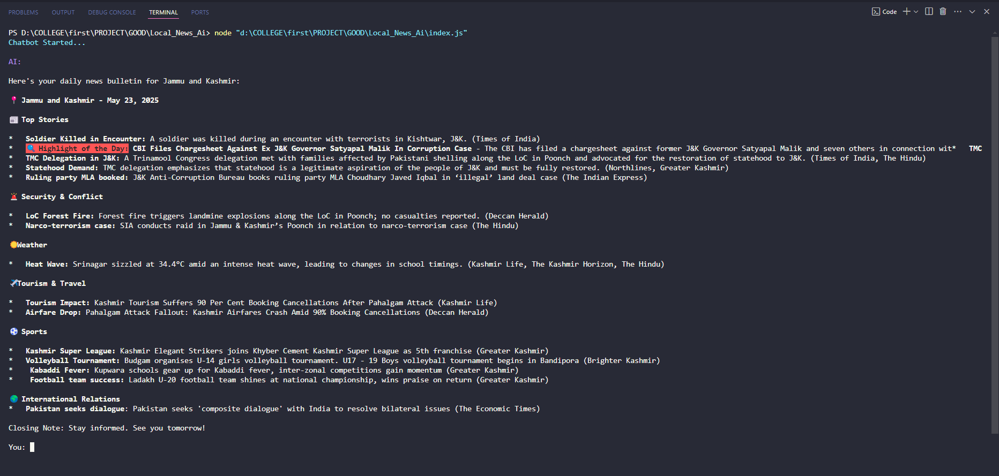

<p align="center">
  
</p>

<h1 align="center">🧠 CityScope AI: Smart City News Reporter</h1>

<p align="center">
  <b>AI-powered local news summarizer built with LangChain, Gemini, IP API & Google News.</b><br>
  <i>Delivers personalized city news bulletins using your IP address 🌍</i>
</p>

<p align="center">
  
  
  
  
  
</p>

---

## 📰 Features

✅ Detects user’s city using IP  
✅ Fetches the latest city-specific news  
✅ Summarizes headlines with **AI-powered Gemini**  
✅ Groups news into categories: `Top Stories`, `Politics`, `Weather`, etc.  
✅ Styled terminal output with **colorful markdown**  
✅ Supports follow-up questions on the news  
✅ Highlight of the Day for impactful headlines

---

## 📸 Demo

> 📽️ Coming Soon: [Watch on YouTube](#)  
> Here's a quick preview of the terminal output:



---

## 🏗️ Tech Stack

| Tool            | Use Case                      |
|-----------------|-------------------------------|
| LangChain       | Prompt templates & chat logic |
| Google Gemini   | Generative AI (LLM)           |
| ipapi.com       | Get location from IP address  |
| Google News API | Fetch relevant news data      |
| Node.js         | Runtime and CLI interaction   |
| Chalk / ANSI    | Terminal color formatting     |

---

## 🚀 Getting Started

### 1. Clone this repo

```bash
    git clone https://github.com/YOUR_USERNAME/YOUR_REPO_NAME.git
    cd YOUR_REPO_NAME
```

### 2. Install dependencies

```bash
    npm install
```


### 3. Add your .env file

```bash
    google_api_key=your_google_gemini_api_key
    ip_api_key=your_ipapi_key
    news_api_key=your_serpapi_key
```


### 4. Run the app

```bash
    node index.js
```


### 🧪 Example Output

```bash
    AI:📍 City: Bangalore | Date: May 22, 2025

    ### 📰 Top Stories
    • **Metro Expansion Approved** - The city has sanctioned a major metro route extension. (source: Times of India)

    ### 🏛 Politics
    • **CM addresses water crisis** - Talks on infrastructure overhaul begin today. (source: NDTV)

    🔍 Highlight of the Day:
    • **Bangalore Airport Wins Global Award** - Recognized for sustainable design and passenger satisfaction. (source: The Hindu)

    Stay informed. See you tomorrow!
```

## 🧠 How It Works
    
🌍 Detect Location <br>
    Uses your IP address via ipapi.com to identify your city.<br>

📰 Fetch News <br>
    Uses Google News (via SerpAPI) to get the latest headlines for your city.<br>

🧠 AI Summarization<br>
    Passes the news JSON to Google Gemini via LangChain to:<br>
        • Summarize<br>
        • Group by category<br>
        • Highlight important stories<br>

### 🎨 Colorized Output
Displays a beautifully formatted and color-coded news bulletin in your terminal with:
    •Headings
    •Emojis
    •Bullet points
    •Rich markdown feel

## 🔁 Interactive Chat
Ask follow-up questions about the news!
The AI will respond accordingly.

## 📌 Upcoming Features 
    🔊 Text-to-Speech: Listen to the news as a podcast
    📤 Export to PDF/HTML for sharing
    ⏰ Daily Scheduled Summaries 
    🌐 Web Dashboard version 

## 🤝 Contributing 
    Contributions are welcome! Here’s how you can help:
    •🚀 Suggest a new feature
    •🐞 Report bugs or issues
    •📄 Improve documentation

<br>
To contribute, fork the repo, create a feature branch, and open a pull request.

## 📄 License
    This project is licensed under the MIT License.
    See the LICENSE file for more details.
<br>
<p align="center">  <i>Built with LangChain, Gemini, and a passion for local journalism 📰</i><br> <b>CityScope AI • © 2025</b> </p>

